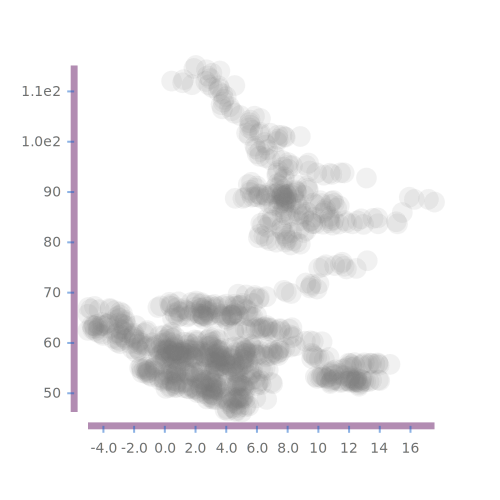

<meta charset="utf-8"> <link rel="stylesheet" href="other/lhs.css">

[online](https://tonyday567.github.io/readme-lhs/index.html) [](https://travis-ci.org/tonyday567/online)
====================================================================================================================================================================

Exploring the design space of online algorithms, charting, statistics
and haskell.

``` {.sourceCode .literate .haskell}
import Protolude hiding ((%))
import Control.Monad.Primitive (unsafeInlineIO)
```

online library
--------------

``` {.sourceCode .literate .haskell}
import Online
import qualified Control.Foldl as L
```

tl;dr

online turns a statistic (a summary or fold of data) into an online
algorithm.

motivation: a simple moving average
-----------------------------------

To start somewhere, let's deconstruct the calculation of a simple moving
average. Here's an average:

    av xs = (sum xs/length xs)
    -- av [0..10] == 5.0

Imagine that there is a data stream, arriving in an sequence (an
ordering from first to last). As the data values arrive, a state
variable is updated which is the moving average of the last 3 values
(ma3). To calculate ma3, the values so far would be multiplied by the
following weights, summed, and divided by 3.

When 6 values have been consumed so far, the ma3 is:

    sum(xs * [0 0 0 1 1 1])/3

The next value streams in, and the ma3 calculation weights now looks
like this:

    0 0 0 0 1 1 1

The difference between these weights and the previous weights is:

    w = [0 0 0 -1 0 0 1]

So that the ma3 can be calculated as
$ma3_t = ma3_{t-1} + \sum (w * xs)/3$

a better moving average
-----------------------

There are other weighting schemes, and a better one than the simple
moving average is the exponential moving average, where the weights look
like this:

    0.1 * [... (0.9^2) (0.9^1) (0.9^0) _]

    0.1 * [... (0.9^3) (0.9^2) (0.9^1) 1]

So that the difference is:

    0.1 * [... (-0.1 * 0.9^2) (-0.1 * 0.9^1) (-0.1 * 0.9^0) 1]

And, as it happens, $ema_{t} = 0.9 * ema_{t-1} + 0.1 * x_t$

This state variable (or statistic) is quite compact (one state variable
being the current ma) compared with the simple moving average where the
last n values need to be remembered in order to drop the nth oldest each
update. This also makes it blaxingly fast compared to the simple average
update.

More generally, the baseline narrative of an online moving average -
what have the values averaged lately - tends towards preferring the
exponential version as:

-   very old values are almost forgotten ie not be influencing the
    current moving average much at all, compared with the simple moving
    average where past values go from having no effect to a lot at an
    arbitrary point in the history.
-   newer values should hold more weight than older ones; weights are
    monotonicaly decreasing from latest to oldest value.

online
------

`online` reifies this pattern into the foldl library api:

    av xs = L.fold (online id (*0.9)) xs
    -- av [0..10] == 6.030559401413827
    -- av [0..100] == 91.00241448887785

And provides an intuitive representation of how big recent numbers have
been at the end of a \[0..100\] data stream: 91ish rather than 50 when
comparing the lifetime average.

online exposes:

-   a decay function governing the rate at which the statistic decays.
-   a stat function, that is the statistic to be computed.

decay
-----

The decay function `(*r)` can be widely interpreted:

-   a decay function equal to `id` provides lifetime statistical
    calculations ie no forgetting.
-   a decay function of `const 0` (or `(*0)`) provides the latest value
    ie always forget.
-   in physical systems, an exponential-weighted moving average where
    the center-of-mass is x would be isomorphic to a decay function
    of (\*(1-1/x)).
-   where the data represents time series, the center-of-mass is often
    referred to as duration. The duration of (\*0.99) is 100.
-   in bayesian methods, a learning rate of x is often equivalent to a
    statistic being decayed or forgotten by (\*(1-x))

stat
----

stat is a premap function that is the statistic of interest:

    av = online id id

is a classical average over the whole sample with no forgetting.

    ma x = online id (*0.9)

is a moving average with a decay rate of 0.9.

    sqav = online (*2) id

is a lifetime squared average.

foldl Fold's are applicative functors, so:

    std = (\s ss -> sqrt (ss - s**2)) <$> av <*> sqav

is the standard deviation.

An exponentially-weighted moving average is then:

    estd x x' = (\s ss -> sqrt (ss - s**2)) <$> online id (*x) <*> online (*2) (*x')

Note that, unlike the usual calc, the mean is conditional; itself a
weighted average calculation, and with potentially a different decay
function.

Just about any statistic can be made online. Here's an online, tuple
correlation stat:

    cov r = (\xy xbar ybar -> xy - xbar * ybar) <$> online (uncurry (*)) r <*> online fst r <*> online snd r
    corr r = (\cov' stdx stdy -> cov' / (stdx * stdy)) <$> cov r <*> L.premap fst (std r) <*> L.premap snd (std r)

cassava
-------

csv data arrives as a bytestring, gets decoded as a Vector, and decoding
errors arrive as strings, so there's a fair bit of messiness working
with Text Lists.

``` {.sourceCode .literate .haskell}
import Data.Csv
import GHC.Base (String)
import Data.Text (pack)
import Data.Text.Encoding (encodeUtf8Builder)
import Data.ByteString.Builder (toLazyByteString)
import Data.Vector (Vector)
```

pretty printing
---------------

``` {.sourceCode .literate .haskell}
import Formatting
```

chart-unit
----------

``` {.sourceCode .literate .haskell}
import Chart.Unit
```

data munge
----------

data is from
[yahoo](https://www.quandl.com/data/YAHOO/INDEX_GSPC-S-P-500-Index) and
consists of the following fields:

    Date,Open,High,Low,Close,Volume,Adjusted Close

Stats are soley on adjusted close.

``` {.sourceCode .literate .haskell}
data YahooRep = YahooRep
  { date :: ByteString
  , open :: ByteString
  , high :: ByteString
  , low :: ByteString
  , close :: ByteString
  , volume :: ByteString
  , adjustedClose :: !Double
  } deriving Generic

instance FromRecord YahooRep
```

The base unit for analysis (which I've called ys to abstract) is
log(1+return). Returns are geometric by nature, and this premap removes
the effect before we get to distributions.

``` {.sourceCode .literate .haskell}
ys :: [Double]
ys = fmap (\x -> log (1+x)) $ ret $ reverse $ unsafeInlineIO $ do
    bs <- readFile "other/YAHOO-INDEX_GSPC.csv"
    let rawdata =
            decode HasHeader (toLazyByteString $ encodeUtf8Builder bs)
            :: Either String (Vector YahooRep)
    case rawdata of
        (Left e) -> panic $ pack e
        (Right xs) -> pure $ adjustedClose <$> toList xs

ret :: [Double] -> [Double]
ret [] = []
ret [_] = []
ret xs = L.fold diff' xs
    where
        diff' = L.Fold step ([], Nothing) fst
        step x a = case snd x of
            Nothing -> ([], Just a)
            Just a' -> ((a-a')/a':fst x, Just a)
```

main
----

main constructs output into charts and markdown fragments which are
stitched together in this file using pandoc.

    stack install && readme && pandoc -f markdown+lhs -t html -i readme.lhs -o readme.html --filter pandoc-include

Think ipython notebook style without the fancy.

``` {.sourceCode .literate .haskell}
main :: IO ()
main = do
```

The test data is the daily S&P500 price index.

Time and money both tend towards being geometric, so a natural
transformation is to look at the differences in log price as the main
unit of analysis. This is also the log(1+return).

To abstract a bit, I'm going to name them ys. The xs in the data is
time, but I'm choosing to forget this data piece and just retain the
ordering information. So xs can be thought of as \[0..\] in most cases.

This also makes the ys additive so that sum(ys) is always and
meaningfully log(1+return) over the range being summed.

The first 2k ys:


``` {.sourceCode .literate .haskell}
    fileSvg "other/elems.svg" (300,300)
        (barRange
         (barChart . chartAxes . element 0 . axisTickStyle .~ TickNone $ def)
         (zip [0..] (take 2000 ys)))
    fileSvg
        "other/asum.svg" (300,300)
        (lineXY
         (lineChart . chartAxes .~
          fmap (axisTickStyle .~ TickNone)
           (def ^. chartAxes) $ def)
         (zip [0..] (L.scan L.sum ys)))
```

Accumulated sum of ys aka `L.scan L.sum ys`:


basic stats
-----------

online mean and std at a 0.99 decay rate:


``` {.sourceCode .literate .haskell}
    let st = drop 1 $ L.scan ((,) <$> (ma 0.9) <*> (std 0.99)) ys
    fileSvg "other/moments.svg" (300,300) $ (linesXY def $
        [ zip [0..] (fst <$> st)
        , zip [0..] (snd <$> st)
        ])
```

scan of 1000 recent ma 0.99 and std 0.99 rendered as an XY scatter.



``` {.sourceCode .literate .haskell}
    fileSvg "other/scatter.svg" (500,500) $
        scatterXY def $ drop (length ys - 1000) $
        L.scan ((,) <$> (ma 0.99) <*> (std 0.99)) ys
```

histogram
---------

A histogram of all elements, outliers truncated.


``` {.sourceCode .literate .haskell}
    let h = toXY $ fill (rangeCuts 100 (-0.02) 0.02) ys
    fileSvg "other/hist.svg" (300,300) $
      barRange
      (barChart . chartAxes .~
       [axisTickStyle .~ TickLabels
        (sformat (prec 2) <$> rangeCuts 4 (-0.02) 0.02)
        $ def] $ def)
      h
```

quantiles
---------

One problem with a histogram is the necessity of a prior about binning
range and size. An online approach - enforcing a single step through the
data starting from scratch - tends to push these two-pass problems to
the surface.

A similar statistic is a quantile computation, where bin ranges are
allowed to vary, with bin edges converging to quantiles (or percentiles
or whatever). The decay method is to shrink the cuts towards the latest
value.

    [min, 10th, 20th, .. 90th, max]: -0.229 -0.00741 -0.00603 -0.00292 -0.00110 0.000469 0.00203 0.00388 0.00667 0.00854 0.110
    online [min, 10th, 20th, .. 90th, max] with decay rate = 0.996 (one year) -0.0339 -0.00504 -0.00175 -0.000316 0.000465 0.000828 0.00137 0.00238 0.00391 0.00677 0.0133

``` {.sourceCode .literate .haskell}
    writeFile "other/quantiles.md" $
        "\n    [min, 10th, 20th, .. 90th, max]:" <>
        mconcat (sformat (" " % prec 3) <$> toList
                 (L.fold (quantiles' 11) ys)) <>
        "\n    online [min, 10th, 20th, .. 90th, max] with decay rate = 0.996 (one year)" <>
        mconcat (sformat (" " % prec 3) <$> toList
                 (L.fold (quantiles 11 identity 0.996) ys))
```

digitize
--------

A related computation is to output the quantile of each value:

    first 100 values digitized into quantiles: 0.00 0.00 1.00 1.00 1.00 3.00 2.00 2.00 2.00 2.00 2.00 2.00 2.00 1.00 1.00 2.00 3.00 3.00 3.00 2.00 3.00 2.00 1.00 3.00 2.00 4.00 4.00 1.00 3.00 1.00 2.00 1.00 4.00 1.00 2.00 1.00 4.00 3.00 3.00 2.00 1.00 1.00 4.00 2.00 1.00 3.00 3.00 2.00 3.00 2.00 3.00 3.00 4.00 2.00 2.00 4.00 4.00 2.00 3.00 1.00 4.00 1.00 2.00 4.00 2.00 3.00 4.00 2.00 2.00 1.00 2.00 3.00 3.00 4.00 4.00 2.00 2.00 4.00 2.00 3.00 1.00 3.00 3.00 3.00 3.00 4.00 1.00 1.00 4.00 3.00 1.00 4.00 2.00 1.00 4.00 4.00 4.00 1.00 2.00 2.00

``` {.sourceCode .literate .haskell}
    writeFile "other/digitize.md" $
        "\n    first 100 values digitized into quantiles:" <>
        mconcat ((sformat (" " % prec 3) <$>)
                 (take 100 $ L.scan (digitize 5 identity 0.996) ys))

    filePng "other/scratchpad.png" (400,400) $ linesXY def
        [zip [0..] (L.scan L.sum ys), zip [0..] ((2*)<$>(L.scan L.sum ys))]
```

workflow
--------

    stack install && readme && pandoc -f markdown+lhs -t html -i readme.lhs -o index.html --filter pandoc-include
